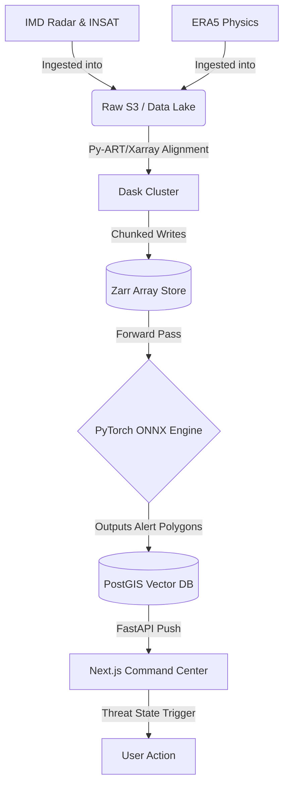

<div align="center">
  <h1>🌩️ VAJRA</h1>
  <p><strong>Vision-Aided Joint Radar & Atmospheric Nowcasting</strong></p>
  
  [](LICENSE)
  [](https://github.com/CodeNinja22-AS/VAJRA/issues)
  [](https://nextjs.org/)
  [](https://pytorch.org/)
  [](https://fastapi.tiangolo.com/)
  [](https://dask.org/)
</div>

<hr />

## 🌐 Live Demo & Pitch
- **Live Platform:** [Deploying Soon]
- **Pitch Video:** [Coming Soon]

## 💡 The Vision & Problem Statement
### The Problem
Weather nowcasting (predicting events 0-2 hours ahead) is notoriously difficult. Global NWP (Numerical Weather Prediction) models like GFS/ECMWF are excellent for days in advance but fail to capture highly localized, sudden convective storms (flash floods, microbursts). Pure optical-flow AI models often hallucinate storms because they extrapolate visual radar patterns without understanding the underlying physics.

### Our Solution
**VAJRA** bridges this gap. It is a highly-scalable, physics-informed AI nowcasting engine. It fuses distinct modalities:
1. **Radar Reflectivity (Z)** for real-time precipitation intensity.
2. **Satellite IR/WV** for cloud-top glaciation and divergence.
3. **Atmospheric Thermodynamics (CAPE, Shear)** from ERA5/GFS to ensure predictions are grounded in physical reality.

## ✨ Key Features
- 🚀 **Physics-Informed Fusion:** Real-time mathematical fusion of Radar, Satellite, and NWP data tensors via ConvLSTM/Transformers.
- 🗺️ **3D Mapbox Command Center:** Immersive, tilted 3D map environment with extruded terrain (`raster-dem`) and city infrastructure.
- 🚨 **Dynamic "Threat State" Theming:** Reactive Next.js UI that pulses and shifts color palettes (crimson glows) instantly upon detecting severe weather thresholds.
- 🌪️ **Animated Wind Particles:** High-performance custom HTML5 Canvas WebGL overlay streaming thousands of animated wind shear vectors.
- 🔬 **Microscopic Sector Drill-Down:** Click anywhere on the 1km resolution map to instantly extract exact mm/hr forecasts, CAPE, and Wind Shear for that specific pixel.

## 📁 Directory Structure
```text
.
├── data/
│   ├── raw/             # Raw IMD, ERA5, INSAT data (Not committed)
│   └── processed/       # Aligned Zarr stores
├── docs/                # draw.io diagrams and architecture docs
├── models/              # Exported ONNX / XGBoost models
├── src/
│   ├── api/             # FastAPI backend service
│   ├── features/        # Zarr grids and alignment
│   ├── ingestion/       # Cron fetchers (IMD, ERA5)
│   └── models/          # PyTorch training loops (ConvLSTM)
├── ui/                  # Next.js 14 Command Center Dashboard
├── pyproject.toml       # Python dependencies (uv)
└── README.md
```

## 🏗️ System Architecture & Data Flow
VAJRA operates as a distributed High-Performance Computing pipeline spanning Data Lakes, Dask processing, PyTorch intelligence, and a Next.js Presentation layer.



## 🚀 Deployment & Getting Started

### 🐳 Quickstart: Docker Compose (Recommended for Production)
The simplest and fastest way to deploy the entire VAJRA stack (Next.js Command Center + FastAPI Backend) in production:

```bash
# 1. Clone repository
git clone https://github.com/CodeNinja22-AS/VAJRA.git
cd VAJRA

# 2. Configure environment (optional: set your Mapbox token)
cp .env.example .env

# 3. Build and launch all services
docker compose up --build -d
```
- **Next.js UI:** [http://localhost:3000](http://localhost:3000)
- **FastAPI Backend:** [http://localhost:8000](http://localhost:8000)
- **Interactive Swagger Docs:** [http://localhost:8000/docs](http://localhost:8000/docs)

---

### 💻 Manual / Local Development Setup

#### 📋 Prerequisites
- Python 3.11 or 3.12
- Node.js (v18+)
- `uv` (Fast Python package manager)

#### ⚙️ 1. Setup Backend
```bash
# Create virtual environment and install serving dependencies
uv venv --python 3.12
.venv\Scripts\activate   # On Windows (or 'source .venv/bin/activate' on Linux/macOS)
uv pip install -r requirements.txt

# Start backend server
python main.py
```

#### ⚙️ 2. Setup Frontend
```bash
cd ui
npm install
npm run dev      # For development
# OR for production:
npm run build
npm run start
```

### 🔒 Environment Configuration
Refer to `.env.example` for available options:
```env
# Backend
PORT=8000
ENV=production
CORS_ORIGINS=http://localhost:3000,http://127.0.0.1:3000

# Frontend
NEXT_PUBLIC_API_URL=http://localhost:8000
NEXT_PUBLIC_MAPBOX_TOKEN="pk.eyJ1Ijoi..."
```

## 🛠️ API Reference
| Method | Endpoint | Description |
|--------|----------|-------------|
| GET    | `/health` | Healthcheck and model loading status |
| GET    | `/api/nowcast` | Live nowcast telemetry, multi-horizon precipitation curve, active alerts |
| GET    | `/api/radar/frame/{time_idx}` | Serves dynamic 512x512 PNG Doppler reflectivity overlays |
| GET    | `/api/telemetry/{lat}/{lon}` | Localized sector thermodynamic indices (CAPE, Shear, QPF) |
| POST   | `/predict` | Ingests atmospheric feature tensors, returns thunderstorm probability grids |

## 🧗 Challenges & Triumphs
Aligning raw polar Doppler Radar sweeps with Geostationary Satellite imagery and coarse Lat/Lon NWP models was a massive spatial engineering challenge. We implemented a unified 1km Cartesian Master Grid and utilized `Dask` distributed computing with `Zarr` array stores to perform this interpolation, preventing out-of-memory crashes on massive meteorological tensors.

## 🛡️ Security & Vulnerability Reporting
If you discover a security vulnerability, please email **security@example.org** directly.

## 👥 The Team
- **Abhrant Singh** - Architect / Lead Engineer

## 📄 License
This project is licensed under the MIT License - see the [LICENSE](LICENSE) file for details.
