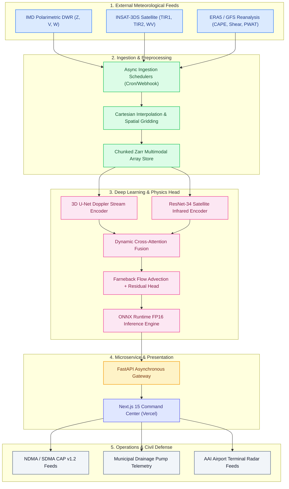

<div align="center">
  <h1>🌩️ VAJRA</h1>
  <p><strong>Vision-Aided Joint Radar & Atmospheric Nowcasting Engine</strong></p>
  <p>Physics-Informed Deep Learning for Severe Thunderstorm, Cloudburst & Flash Flood Nowcasting</p>
  
  [](LICENSE)
  [](https://vajra-qpqb.vercel.app)
  [](https://vajra-production-aad1.up.railway.app)
  [](https://nextjs.org/)
  [](https://pytorch.org/)
  [](https://fastapi.tiangolo.com/)
  [](https://onnxruntime.ai/)
</div>

<hr />

## 🌐 Live Deployments & API Documentation
- **Live Interactive Dashboard (Vercel):** [https://vajra-qpqb.vercel.app](https://vajra-qpqb.vercel.app)
- **Live Production API (Railway):** [https://vajra-production-aad1.up.railway.app](https://vajra-production-aad1.up.railway.app)
- **Interactive OpenAPI / Swagger Docs:** [https://vajra-production-aad1.up.railway.app/docs](https://vajra-production-aad1.up.railway.app/docs)

---

## 🏆 Smart India Hackathon (SIH) Context

| Field | Detail |
| :--- | :--- |
| **Project Title** | **VAJRA: Vision-Aided Joint Radar & Atmospheric Nowcasting Engine for Severe Convection & Civil Defense** |
| **Technology Bucket** | **AI/ML, Cloud Computing, Blockchain** (Primary Fit: AI/ML & Cloud Computing) |
| **Domain** | Disaster Management, Aviation Safety, Hydrometeorological Nowcasting (0–2 Hours) |
| **Target End-Users** | NDMA, SDMAs, Municipal Corporations (BBMP, BMC), Airport Authority of India (AAI), IMD |

### Executive Abstract
Extreme convective weather events—such as cloudbursts, severe tornadic supercells, urban flash floods, and airport microbursts—develop within sub-hourly timescales. Traditional Numerical Weather Prediction (NWP) models (e.g. GFS, NCMRWF) are computationally constrained by 3-to-6-hour assimilation cycles and miss localized convective bursts. Conversely, purely computer-vision advection models (optical flow, ConvLSTMs) suffer from rapid forecast blur and disregard atmospheric physics.

**VAJRA** solves this operational bottleneck by deploying a **multimodal, physics-constrained nowcasting architecture** fusing three critical real-time data streams:
1. **Polarimetric Doppler Weather Radar (DWR):** Real-time precipitation reflectivity ($Z$), radial velocity ($V$), and spectrum width ($W$).
2. **Geostationary Satellite Imagery (INSAT-3DS):** Rapid cloud-top cooling rates ($TIR1, TIR2$) and atmospheric water vapor ($WV$) channels.
3. **Deep Atmospheric Thermodynamics & Kinematics (ERA5/GFS):** Surface and column instability parameters ($CAPE, CIN, \theta_e, \text{0–6km Bulk Shear}, PWAT$).

VAJRA provides actionable early warnings **+42 to +46 minutes prior to peak ground inundation**, with direct integration into municipal pump networks and OASIS Common Alerting Protocol (CAP v1.2) emergency broadcasts.

---

## ✨ System Architecture & Multi-Dashboard Suite

### 1. 🎛️ Live Radar Command Center (`/`)
- Dynamic 0.5km resolution Cartesian Doppler radar overlay with 18 temporal horizons ($T+0\text{m}$ to $T+85\text{m}$).
- Real-time time scrubber, looping animations, and instant switching between High-Res Doppler Reflectivity and INSAT-3DS Satellite Fusion.
- Telemetry sidebar with physics fusion indicators (CAPE, Bulk Shear, AQI, QPF).

### 2. 🛡️ Municipal Disaster Operations & Civil Defense (`/disaster-ops`)
- **Ward-Level Flood Vulnerability Matrix:** Dynamic tracking of vulnerable wards (Bellandur, Silk Board, Koramangala, Hebbal) with live rain rates and inundation depths.
- **Municipal Pump Station Dispatch:** Real-time capacity toggling (`/api/disaster-ops/pumps/{ward_id}/toggle`) for automated stormwater pump readiness.
- **CAP v1.2 Standardized XML Alerts:** Automated generation of NDMA/SDMA-compliant Common Alerting Protocol XML feeds.
- **Public Cell Alert Broadcast:** Instant simulated broadcast routing to state disaster control rooms and traffic police networks.

### 3. ✈️ Aviation Terminal Weather & Runway Safety (`/aviation`)
- Operational aerodrome monitoring for major Indian hubs: Kempegowda (`VOBL`), Indira Gandhi (`VIDP`), and Chhatrapati Shivaji (`VABB`).
- Low-Level Wind Shear (LLWS) and convective microburst detection across active runways (`09L/27R`, `09R/27L`).
- Real-time METAR and TAF string decoding with flight diversion probability analytics.
- Inbound arrival corridor waypoint monitoring (LEKOP, GUNIM, TELKO, and holding stacks).

### 4. 🌡️ Vertical Soundings & Thermodynamics (`/thermodynamics`)
- Skew-T Log-P deep-troposphere thermodynamic sounding curves (Ambient Temperature, Dewpoint, Lifted Parcel).
- 8 critical convective instability metrics: SBCAPE, MUCAPE, CIN, Lifted Index, 0-6km Bulk Shear, SRH 0-3km, K-Index, and PWAT.
- Key convective atmospheric boundaries: Equilibrium Level (EL), Freezing Level ($0^\circ\text{C}$ Isotherm), Level of Free Convection (LFC), and Lifted Condensation Level (LCL).

### 5. ⏪ Historical Storm Replay Case Studies (`/replay`)
- Step-by-step hindcast evaluation comparing VAJRA predictions against operational NWP models and ground rain gauges:
  - **Case 1:** Bengaluru September 2022 Flash Flood (+46m early lead time, 0.86 CSI).
  - **Case 2:** Cyclone Michaung Convective Rainbands (+55m early lead time).
  - **Case 3:** Delhi Squall Line Derecho (96 km/h winds).
- Interactive hydrographs with timeline step progression ($T-45\text{m}$ to $T+45\text{m}$).

### 6. 📊 Meteorological Validation & Analytics (`/analytics`)
- Rigorous statistical verification benchmarks evaluated across July 2023 Monsoon convection suites.
- Quantitative KPI scores: **Critical Success Index (CSI) 0.82**, **Probability of Detection (POD) 0.91**, **False Alarm Ratio (FAR) 0.14**.
- Forecast skill score decay curves comparing VAJRA against Farneback Optical Flow, Persistence, and GFS 0.25° NWP.

### 7. 🧠 Model Architecture & Explainable AI (XAI) (`/models`)
- Multi-scale 3D U-Net and ResNet-34 encoders for radar, satellite, and gridded physics tensors.
- Cross-attention fusion balancing clear-sky convection vs. developed kinematic supercells.
- Game-theoretic **SHAP (Shapley Additive exPlanations)** attribution bars detailing feature importance (CAPE 38%, dBZ Surge 26%, Cloud-Top Glaciation 18%, Bulk Shear 11%).

---

## 🏗️ Technical Pipeline & Data Flow



---

## 🛠️ Complete API Reference (FastAPI Backend)

| Method | Endpoint | Description |
| :--- | :--- | :--- |
| `GET` | `/` | Root service metadata and active operational mode |
| `GET` | `/health` | Healthcheck and ONNX / ML model loading status |
| `GET` | `/api/nowcast` | Live nowcast telemetry, multi-horizon precipitation curve, active alerts |
| `GET` | `/api/radar/frame/{time_idx}` | Dynamic 512x512 Doppler radar reflectivity PNG frames |
| `GET` | `/api/telemetry/{lat}/{lon}` | Localized sector thermodynamic indices (CAPE, Shear, QPF) |
| `GET` | `/api/disaster-ops/wards` | Municipal ward flood vulnerability and pump capacity database |
| `GET` | `/api/disaster-ops/infrastructure` | Critical transit, highway, and power asset flood exposure status |
| `POST` | `/api/disaster-ops/pumps/{ward_id}/toggle` | Activates or toggles municipal stormwater drainage pumps |
| `GET` | `/api/disaster-ops/cap-alert` | Generates standardized OASIS CAP v1.2 XML emergency alerts |
| `POST` | `/api/disaster-ops/dispatch-alert` | Broadcasts emergency warnings to NDMA/SDMA emergency nodes |
| `GET` | `/api/aviation/airports` | Multi-aerodrome runway status, crosswind vectors, and microburst alerts |
| `GET` | `/api/aviation/{airport_code}` | Specific ICAO airport weather, runway conditions, and METAR data |
| `GET` | `/api/thermodynamics/sounding/{station_id}` | Atmospheric sounding vertical profile (Pressure, Temp, Dewpoint, Parcel) |
| `GET` | `/api/thermodynamics/indices/{station_id}` | 8 severe weather instability indices for specified station |
| `GET` | `/api/replay/cases` | Available historical storm verification cases |
| `GET` | `/api/replay/{case_id}` | Step-by-step hindcast progression and hydrograph comparison data |
| `GET` | `/api/analytics/benchmarks` | Quantitative CSI, POD, FAR, HSS verification benchmarks |
| `GET` | `/api/models/info` | Multimodal architecture specifications and SHAP importance weights |
| `POST` | `/predict` | Ingests atmospheric feature tensors, returns thunderstorm probability grids |

---

## 🚀 Local Development Setup

### Prerequisites
- Python 3.11 or 3.12
- Node.js 18+ and `npm`

### 1. Backend Setup
```bash
# Clone the repository
git clone https://github.com/Dinesh-Vishwakarma/VAJRA.git
cd VAJRA

# Create virtual environment and install dependencies
python -m venv .venv
# Windows:
.\.venv\Scripts\activate
# Linux/macOS:
source .venv/bin/activate

pip install -r requirements.txt

# Start FastAPI server
uvicorn src.api.main:app --host 0.0.0.0 --port 8000 --reload
```

### 2. Frontend Setup
```bash
cd ui
npm install
npm run dev
```
Open [http://localhost:3000](http://localhost:3000) in your browser.

---

## 📄 License
This project is licensed under the MIT License - see the [LICENSE](LICENSE) file for details.
